# Gitopedia Website

The Gitopedia website is a Next.js static site that renders encyclopedia articles from the Gitopedia repository and provides search functionality via a serverless API.

## Architecture

```mermaid
flowchart TB
    subgraph Build["Build Time"]
        Compendium["gitopedia/Compendium/*.md"]
        GrayMatter["gray-matter<br/>(parse frontmatter)"]
        Remark["remark-html<br/>(markdown → HTML)"]
        NextBuild["next build<br/>(static export)"]
    end

    subgraph Deploy["AWS Deployment"]
        S3["S3 Bucket<br/>(static files)"]
        CloudFront["CloudFront CDN"]
        Lambda["Search Lambda<br/>(Go)"]
        APIGateway["API Gateway"]
    end

    subgraph Runtime["User Experience"]
        Browser["Web Browser"]
        Search["Search Interface"]
    end

    Compendium --> GrayMatter
    GrayMatter --> Remark
    Remark --> NextBuild
    NextBuild --> S3
    S3 --> CloudFront
    
    Browser --> CloudFront
    Search --> APIGateway
    APIGateway --> Lambda
```



## Features

- **Static Site Generation**: Pre-rendered HTML for fast loading
- **Article Metadata Display**: Shows creation date, LLM model, and researcher version
- **Full-Text Search**: Serverless search API powered by SQLite FTS5
- **Work in Progress Disclaimer**: Indicates content reliability status
- **Version Display**: Shows Gitopedia version in footer

## Article Display

Each article page shows:

```
┌─────────────────────────────────────────────────────────┐
│  ⚠️ Work in Progress                                    │
│  This is an early version. Information may be          │
│  incomplete or unreliable.                             │
├─────────────────────────────────────────────────────────┤
│                                                         │
│  # Article Title                                        │
│                                                         │
│  📅 Created: Dec 3, 2025, 4:06 AM UTC                  │
│  🤖 Model: qwen3:32b                                   │
│  📦 Version: 0.3.5                                     │
│                                                         │
│  Article content rendered from markdown...              │
│                                                         │
│  ## References                                          │
│  [^1]: Source title - https://example.com              │
│                                                         │
└─────────────────────────────────────────────────────────┘
```

## Homepage Article List

Articles are sorted by creation date (newest first) and display:
- Title (linked to article)
- Creation datetime
- LLM model used
- Researcher version

## Development

### Prerequisites

```bash
node >= 18
npm >= 9
```

### Local Development

```bash
cd website

# Install dependencies
npm install

# Run development server
npm run dev

# Build static site
npm run build

# Preview production build
npm run start
```

### Environment Variables

```bash
# Set in .env.local or CI environment
NEXT_PUBLIC_GITOPEDIA_VERSION=0.3.5
```

## Project Structure

```
website/
├── pages/
│   ├── index.jsx          # Homepage with article list
│   └── [...slug].jsx      # Dynamic article pages
├── lib/
│   └── content.js         # Markdown parsing and content loading
├── styles/
│   └── globals.css        # Global styles
├── search-api/            # Go Lambda for search
│   ├── main.go
│   └── go.mod
├── next.config.js         # Next.js configuration
├── package.json
└── .github/
    └── workflows/
        └── site-build.yml # CI/CD workflow
```

## Content Loading

The `lib/content.js` module handles:

1. **Directory Scanning**: Recursively finds all `.md` files in Compendium
2. **Frontmatter Parsing**: Extracts YAML metadata using `gray-matter`
3. **Markdown Rendering**: Converts to HTML using `remark-html`
4. **Metadata Extraction**: Pulls `created`, `model`, `researcher_version`

```javascript
// Extracted frontmatter fields
{
  id: "01KBCVQXJS3QK3JCRGTWBFH2A6",
  title: "Quantum Mechanics",
  author: "Gitopedia Researcher",
  summary: "An overview...",
  tags: ["physics", "quantum"],
  created: "2025-12-03T04:06:38Z",  // UTC datetime
  model: "qwen3:32b",
  researcher_version: "0.3.5"
}
```

## Search API

The search API is a Go Lambda that queries the SQLite FTS5 index.

### Endpoint

```
GET /search?q=<query>&limit=10
```

### Response

```json
{
  "results": [
    {
      "id": "01KBCVQXJS3QK3JCRGTWBFH2A6",
      "title": "Quantum Mechanics",
      "path": "Science/Physics/quantum-mechanics",
      "snippet": "...matching text..."
    }
  ]
}
```

### Building the Search API

```bash
cd search-api
GOOS=linux GOARCH=amd64 go build -o bootstrap main.go
zip search-api.zip bootstrap
```

## CI/CD Workflow

The `site-build.yml` workflow:


**Triggers:**
- Push to `main` branch
- `repository_dispatch` from knowledge-base

## Configuration

### next.config.js

```javascript
module.exports = {
  output: 'export',        // Static HTML export
  trailingSlash: true,     // /article/ instead of /article
  images: {
    unoptimized: true      // Required for static export
  }
}
```

### Compendium Path

The content loader looks for articles at:
```
../../gitopedia/Compendium
```

This relative path works for both local development and CI builds.

## Deployment

### AWS Resources (via CDK)

- **S3 Bucket**: Hosts static files
- **CloudFront Distribution**: CDN with HTTPS
- **Lambda Function**: Search API
- **API Gateway**: HTTP endpoint for search

### Manual Deployment

```bash
# Build static site
npm run build

# Sync to S3
aws s3 sync out/ s3://gitopedia-website-bucket --delete

# Invalidate CloudFront cache
aws cloudfront create-invalidation \
  --distribution-id XXXXXXXXXXXX \
  --paths "/*"
```

## Related Documentation

- [Main Architecture](../gitopedia/docs/architecture.md)
- [Search API](search-api/README.md)
- [Integration Guide](../gitopedia/docs/integration.md)
